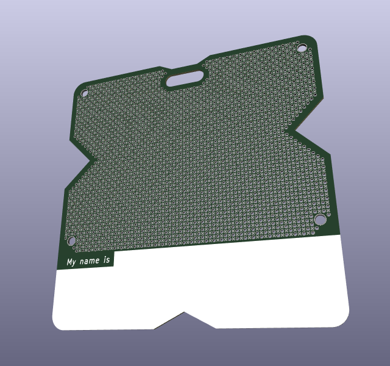
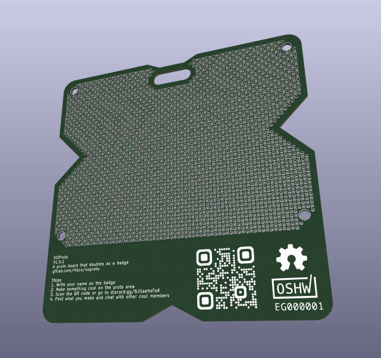

# xoproto

## Description
This is a proto board that doubles as a name tag or a conference badge. It is intended to be used to promote [Egypt Open Source Hardware](https://egoshw.com) community in events like [Techne Summit](https://alex.technesummit.com/2022) or university talks.

## Features
- Two shifted 2.54 mm through hole grids
- X SMD pads between through hole pads
- Area to write your name on

## Usage & example
Just make something and write your name on it.

## Pictures

## TODO
- [ ] Add link to competition
- [x] Get OSHW certificate
- [ ] Build and document examples

## Credits
- [CHANGELOG](./CHANGELOG.md) format is based on [Keep a Changelog](https://keepachangelog.com/en/1.0.0/)
- This project adheres to [Semantic Versioning](https://semver.org/spec/v2.0.0.html)
- And I try my best to follow [Conventional Commits](https://www.conventionalcommits.org/en/v1.0.0/)
- [.gitignore](./.gitignore) was generated using [gitignore.io](https://www.toptal.com/developers/gitignore)

## License
This project is licensed under [TAPR OHL](./LICENSE)
